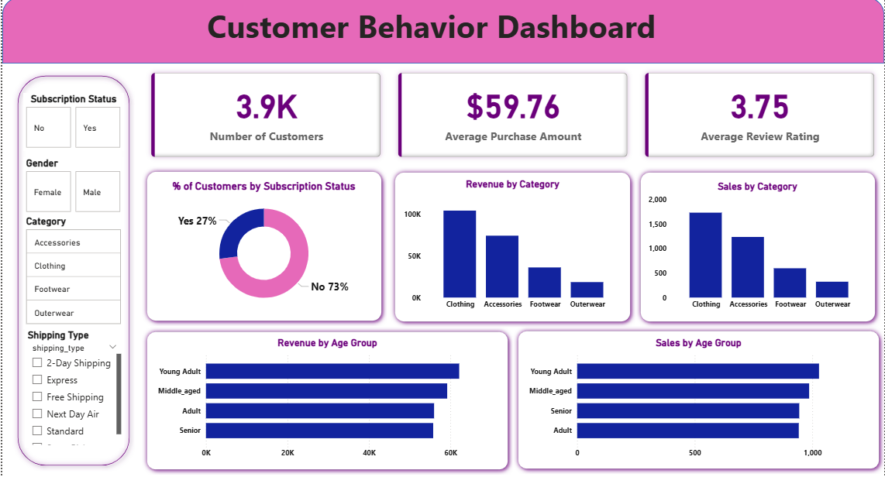

# Customer Behavior Analysis

## Project Overview
This project analyzes customer transactional data to understand purchasing behavior, identify high-value customers, and provide actionable insights for business decisions. The analysis follows an end-to-end workflow using Python, SQL, and Power BI.

## Business Problem
Businesses often need to answer questions such as:
- Which customers contribute the most to revenue?
- How does repeat purchase behavior impact sales?
- What is the effect of discounts on customer spending?
- How can customer behavior insights improve business strategy?

## Tools Used
- **Python** – Data cleaning and preparation  
- **SQL** – Data analysis and querying  
- **Power BI** – Dashboard creation and visualization  

## Dataset
- Contains customer-level transaction data including customer IDs, purchase amounts, product details, discount usage, subscription status, shipping type, previous purchases, age group, and gender.  
- No predefined customer segments were provided; segments were created based on purchasing behavior (previous purchases).  

## Key Analysis & Insights
- Customers with frequent purchases and higher total spending generate most of the revenue.  
- Repeat customers spend more on average than one-time buyers.  
- Certain products receive high discounts but still generate significant revenue.  
- Age and gender affect customer spending patterns.  
- Customers were grouped into **New, Returning, and Loyal** based on the number of previous purchases.

## Dashboard & Visualizations
- Power BI dashboards visualize revenue, customer behavior, product performance, and subscription trends.  

The full Power BI dashboard file is available for download:
[Download Power BI Dashboard](customer_behavior_analysis.pbix)

## Conclusion
This project demonstrates an end-to-end customer behavior analysis using Python for data cleaning, SQL for querying and analysis, and Power BI for visualization. The insights provide actionable recommendations to improve customer retention, optimize marketing strategies, and increase revenue.

